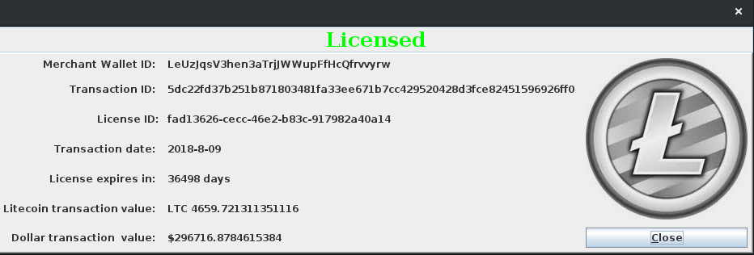
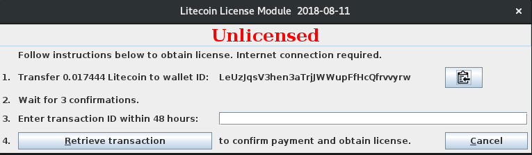
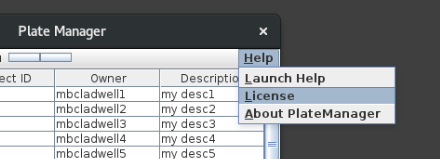

## Litecoin License Module



## Introduction

The Litecoin License Manager is a Java plug-in that will allow you to non-interactively collect software licensing fees from your customers using the cryptocurrency Litecoin. Why Litecoin instead of Bitcoin?

* Availability: Litecoin is available on most exchanges and is readily exchanged for Dollars or Bitcoin.  Check out [Coinbase](www.coinbase.com), which also provides you with a wallet.

* Wallets:  Multiple wallets are available.  My favorite is the lightweight, deterministic brain wallet [Electrum](https://electrum-ltc.org/)

* Low volatility relative to [Bitcoin](https://bitinfocharts.com/comparison/price-btc-ltc-nmc.html).

* Faster [transaction times](https://bitinfocharts.com/comparison/confirmationtime-btc-ltc.html#log) relative to Bitcoin.  A block ascceptance time of 2.5 minutes relative to Bitcoin's 10 minutes.

* [Lower transaction fees](https://bitinfocharts.com/comparison/transactionfees-btc-ltc.html) relative to Bitcoin. A [recent](https://www.businessinsider.com/a-99-million-litecoin-trade-took-just-25-minutes-and-cost-040-2018-4) $99 million Litecoin transaction took 25 minutes and cost 40 cents in fees.

* Litecoin also has an increased maximum number of coins 84,000,000 vs. Bitcoin's 21,000,000 and a different hashing algorithm - scrypt vs. SHA-256.

A Litecoin License encapsuplates a variety of parameters such as license expiration date, number of transaction confimations required, transaction expiration, etc. that allow you to balance ease of Licence attainment with security.  Utilizing the Litecoin License Manager is a three step process:


1.  [Set up your Litecoin Wallet](https://github.com/mbcladwell/LLMLitecoinLicenseGenerator/blob/master/extra/ltcwallet.md) and generate wallet IDs.

2.  Use the Litecoin License Manager License Key Generator to [generate license keys](https://github.com/mbcladwell/LLMLitecoinLicenseGenerator) containing your parameters of interest.

3.  Integrate the Litecoin License Manager with your own software.


The user's (customer's) workflow for obtaining a license looks like this:




Instructions for you the developer:

## Download LLM from Github

Place the jar file on your classpath. If you are working with Gradle, you can install LLM in your local repository and make LLM a dependency.  First add to the local repository:

```bash
       >mvn install:install-file -Dfile=build/libs/llm-0.1.jar -DgroupId=net.stihie -DartifactId=llm -Dversion=0.1 -Dpackaging=jar
```

Check your ./.m2 directory and be sure it is there.  Then in your gradle.build file:


```java
repositories {
     //....
     mavenLocal()
}

dependencies {
	//.......
       compile 'net.stihie:llm:0.1'
}
```


Note that the license file has to be handled separately. Generate a license file with the [Litecoin License Manager License Key Generator](https://github.com/mbcladwell/LLMLitecoinLicenseGenerator) and copy the license to a directory where the user has read/write access.  The license file <code>license.ser</code> should not be packaged in your applications jar file.

## Integrate LLM into your application

Provide a menu item that will launch LLM:



In the ActionListener of your menu item, launch the main window for LLM

```java

    menuItem = new JMenuItem("License", KeyEvent.VK_L);
    menuItem.addActionListener(
        new ActionListener() {
          public void actionPerformed(ActionEvent e) {
            new llm.DialogLicenseManager(/path/to/readwriteaccessible/license.ser);
          }
        });
    menu.add(menuItem);
```

The above code provides a dialog box that the user can use to monitor license parameters and provide license fees.  In addition to the above, with each startup of your application you will want to monitor license status.  Do so with:

```java

    LicenseManager lm = new LicenseManager(/path/to/readwriteaccessible/license.ser);
    int licenseStatus = lm.getLicenseStatus();  //1:Unlicensed  2:Trial period  3:Licensed
```

The initial instantiation of <code>LicenseManager</code> will write the current date to the license file and initiate the trial period, if one was provided.  Future instantiations will calculate days remaining in either the trial period or license period, whichever is in effect.  Payment of a license fee will rewrite the <code>license.ser</code> file with the payment date, which is used in future instantiations to calculate days remaining in the license.


